> *写在前面*：
>
> ​	本人在大一下的暑假开始学习的，有一点c，cpp和oop的基础
>
> ​	有些部分可能会比较简略，甚至直接略过，但主要部分都还是包含的 (❤️ ω ❤️)
>
> ​	有些地方写得可能比较难理解，脉络不是很清晰，你都可以直接问AI 🤗
>
> ​	课程的链接在[这里](https://sp21.datastructur.es/) (～￣▽￣)～
>
> ​	最后祝你无限进步呀 ヾ(≧ ▽ ≦)ゝ


# java简介

## Hello World

一个简单的java程序如下：

``` java
public class HelloWorld {
    public static void main(String[] args)     {
        System.out.println("Hello world!");
    }
}
```

（想起开始学C时的**int main()**了，hhh...)

> *输出*有点不同，注意是**System.out.println();**
>
> 有**ln**就是自带换行

特别一点的语法特征有两点：

- 程序由一个类声明组成，使用关键字 `public class` 声明。在 **Java** 中，所有代码都位于类内部。

- 要运行的代码位于名为 `main` 的方法内部，该方法声明为 `public static void main(String[] args)` 。 

---

## 运行一个 Java 程序

下面是执行Java程序的简略过程：

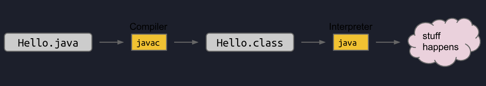

就是*先编译后解释*

若要运行 `HelloWorld.java`，终端上输入：

```java
$ javac HelloWorld.java
$ java HelloWorld
Hello World! 
```

**javac**后会出现一个新文件**HelloWorld.class**，这个后面说

---

## 变量与循环

与C几乎差不多，此处略过

---

## 在 Java 中定义函数

在**Java**中，函数为类的成员，用**public** **static**来声明，例如：

```java
public class LargerDemo {
    public static int larger(int x, int y) 	   {
        if (x > y) {
            return x;
        }
        return y;
    }

    public static void main(String[] args)     {
        System.out.println(larger(8, 10));
    }
}
```

---

## 代码风格，注释

**Java** 的行注释使用 `//` 分隔符，多行注释使用 `/*` 和 `*/` 

在**Javadoc**注释中，多行注释以额外的星号开始，例如 __/**   */__

广泛使用的**Javadoc**工具可用于生成代码的**HTML**描述

---

## 静态方法

我们真正的想要运行一个类的话，我们要么在类里面添加一个`main`，要么再添加一个单独的类来运行其中的`method`(类似在另一个类中调用函数)，一个使用另一个类的类有时被称为该类的“**客户端**”

---

## 实例变量和对象实例化

创建类的实例(类似`oop`里的创建对象)，例如：

~~~java
public class DogLauncher {
    public static void main(String[] args) {
        Dog d;
        d = new Dog();
        d.weightInPounds = 20;
        d.makeNoise();
    }
}
~~~

我们来看看`dog`的代码：

~~~java
public class Dog {
    public int weightInPounds;

    public void makeNoise() {
        if (weightInPounds < 10) {
            System.out.println("yipyipyip!");
        } else if (weightInPounds < 30) {
            System.out.println("bark. bark.");
        } else {
            System.out.println("woof!");
        }
    }    
}
~~~

我们看到：

- 我们在 `Dog` 类中创建的方法没有 `static` 关键字。我们将此类方法称为实例方法或非静态方法。

- 要调用 `makeNoise` 方法，首先需要使用 `new` 关键字实例化一个 `Dog`

如果我们要做到**构造函数**的效果，我们要添加如下的代码：

~~~java
public Dog(int w) {
        weightInPounds = w;
}
~~~

---

## 数组实例化、对象数组

数组的实例化，例如：

~~~java
int[] someArray = new int[5];
~~~

对象的话，就类似：

~~~java
Dog[] dogs = new Dog[2];
~~~

---

## 类方法与实例方法

Java 允许我们定义两种类型的方法：

- **类**方法，又称**静态**方法

- **实例**方法，又称**非静态**方法。

**非静态**方法必须在**实例**上执行，而**静态**则在**类本身**上执行

以**静态**方法为例，`Math` 类提供一个 `sqrt` 方法。由于它是静态的，我们可以按如下方式调用它：

```java
x = Math.sqrt(100);
```

如果用**非静态**的话，就要`new`一个实例，再进行调用，比较麻烦

对于一个**非静态**方法而言，如果要引用自身对象，则可以：

~~~Java
return this;
~~~

**静态变量**，可当作类本身的属性，使用**类名**来访问

---

## main方法

即`public static void main(String[] args)`，我们着重看看命令行参数

例如`java 程序名 a b c`，其中`a`，`b`，`c`就为`args`数组的成员

# 测试

关于测试，我们要创建一个名为 `Sort` 的类，它提供一个名为 `sort(String[] x)` 的方法，该方法对数组 `x` 中的字符串进行破坏性排序。

看代码：

~~~java
public class TestSort {
    /** Tests the sort method of the Sort class. */
    public static void testSort() {
        String[] input = {"i", "have", "an", "egg"};
        String[] expected = {"an", "egg", "have", "i"};
        Sort.sort(input);/** 在类Sort里调用sort */
        for (int i = 0; i < input.length; i += 1) {
            if (!input[i].equals(expected[i])) { /** 不能简单==判断，这个比较的是地址 */
                System.out.println("Mismatch in position " + i + ", expected: " + expected + ", but got: " + input[i] + ".");
                break;
            }
        }
    }

    public static void main(String[] args) {
        testSort();
    }
}
~~~

~~~java
public class Sort {
    /** Sorts strings destructively. */
    public static void sort(String[] x) {        
    }
}
~~~

有一个强大的库，叫`org.junit`，上面的比较可以用`org.junit.Assert.assertArrayEquals(expected, input);`来替换

此外，JUnit有很多改进

第一个改进是使用所谓的“测试注解”。为此，我们：

- 在每个方法之前加入 `@org.junit.Test` （无分号）

- 将每个测试方法改为非静态

- 从 `TestSort` 类中移除我们的 `main` 方法

一旦我们完成这三件事，如果在 JUnit 中重新运行代码，使用 Run->Run 命令，所有测试都会执行，无需手动调用。

第二个改进将允许我们为一些非常冗长的方法名，以及注解名，使用更短的名称

然后我们再添加第二个导入语句 `import static org.junit.Assert.*` 。在这样做之后，我们可以省略任何我们曾经有 `org.junit.Assert.` 的地方。其余的类似

# 列表

## 基础知识

对于**地址**，有一些补充：

~~~java
Walrus a = new Walrus(1000, 8.3);
Walrus b;
b = a;
b.weight = 5;
System.out.println(a);
System.out.println(b);
~~~

上面的代码会输出两个5，这是因为`b`指向`a`所指的实例，两者指向相同，所以会互相影响

当我们声明一个任意**引用类型**的变量（Walrus、Dog、Planet、数组等）时，Java 会分配一个 **64** 位的引用（box），无论对象的实际类型是什么，当然里面存放的是**地址**

一些比较基础的指针知识就不提了 ）

---

## IntList

一个基础的列表如下：

~~~java
public class IntList {
    public int first;
    public IntList rest;        

    public IntList(int f, IntList r) {
        first = f;
        rest = r;
    }
}
~~~

`first`为头部的值，`rest`为尾部指针，指向其他链的头部

例来说，如果我们想要创建一个包含数字 5、10 和 15 的列表，我们可以这样做：

~~~java
IntList L = new IntList(5, null);
L.rest = new IntList(10, null);
L.rest.rest = new IntList(15, null);
~~~

这是从前往后构建，不是很好看，那么从后往前呢？

~~~java
IntList L = new IntList(15, null);
L = new IntList(10, L);
L = new IntList(5, L);
~~~

结果都是如下图：

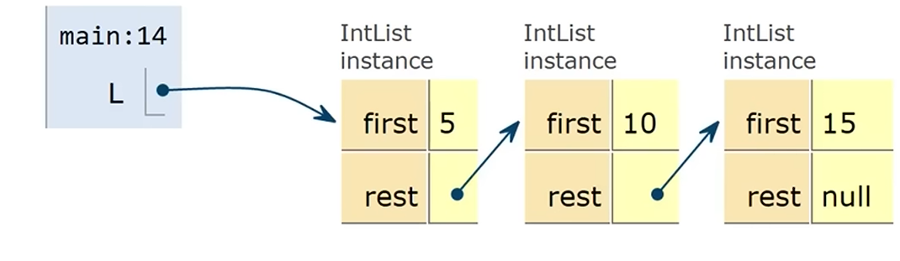

如果我们要得到列表的**大小**和**迭代大小**，我们不难考虑到递归和循环

~~~java
public int size() {
    if (rest == null) {
        return 1;
    }
    return 1 + this.rest.size();
}
~~~

~~~java
public int iterativeSize() {
    IntList p = this;
    int totalSize = 0;
    while (p != null) {
        totalSize += 1;
        p = p.rest;
    }
    return totalSize;
}
~~~

如果我们要得到第 `i` 个元素

~~~java
public int get(int i) {
    if(i == 0){
        return first;
    }
    return rest.get(i - 1);
}
~~~

---

## SLList

 不难感觉到，原先的`IntList`是比较难以阅读和维护的

~~~java
public class IntList {
    public int first;
    public IntList rest;

    public IntList(int f, IntList r) {
        first = f;
        rest = r;
    }
...
~~~

难处理的地方就在于`Intlist rest`，我们考虑创建一个名为 `SLList` 的单独类，并把`IntList`更名为`IntNode`

~~~java
public class SLList {
    public IntNode first;

    public SLList(int x) {
        first = new IntNode(x, null);
    }
}
~~~

跟原先的相比，似乎没什么意义

两者进行创建时

~~~java
IntList L1 = new IntList(5, null);
SLList L2  = new SLList(5);
~~~

`SLList` 隐藏了从用户处存在一个空链接的细节，但还不是很有用，让我们再加点东西

~~~java
public void addFirst(int x) {
    first = new IntNode(x, first);
}
public int getFirst() {
    return first.item;
}
~~~


但`SLList`还是不够安全，`next`和`item`都是可被访问的，造成非常多的麻烦

那我们就得对其经行一定的**封装**

~~~java
private IntNode first;
~~~

然后再用**嵌套类**进行改进

~~~java
public class SLList {
       public static class IntNode {
            public int item;
            public IntNode next;
            public IntNode(int i, IntNode n) {
                item = i;
                next = n;
            }
       }

       private IntNode first;
...
~~~

**IntNode**无需访问外部任何成员，那就直接`static`，可节省一点内存

现在再加一点东西

~~~java
public void addLast(int x){
    IntNode p = first;
    while(p.next != null){
        p = p.next;
    }
    p.next = new IntNode(x, null);
}

public int size(IntNode p){
    if(p.next == null){
        return 1;
    }
    return 1 + size(p.next);
}
~~~

`size`方法是线性的，还是比较慢，我们可以添加一个变量来跟踪

~~~java
public class SLList {
    ... /* IntNode declaration omitted. */
    private IntNode first;
    private int size;

    public SLList(int x) {
        first = new IntNode(x, null);
        size = 1;
    }

    public void addFirst(int x) {
        first = new IntNode(x, first);
        size += 1;
    }

    public int size() {
        return size;
    }
    ...
}
~~~

SLList还有一个优点，就是能轻松实现创建空列表

~~~java
public SLList() {
    first = null;
    size = 0;
}
~~~

而空列表在调用`addLast`函数时，会崩溃

由于 `first` 是 `null` ，在 `while (p.next != null)` 的 `p.next` 处尝试访问时会造成空指针异常。

你可能觉得这不就是一个**if**语句的事吗，但对于更复杂的数据结构而言，不断地列**if**会非常糟糕，我们需要一个更干净通用的解决方法

我们可以通过创建一个**始终存在**的**特殊节点**来实现，我们称之为**哨兵节点**。哨兵节点将保存一个值，我们不在意它的值

例如：

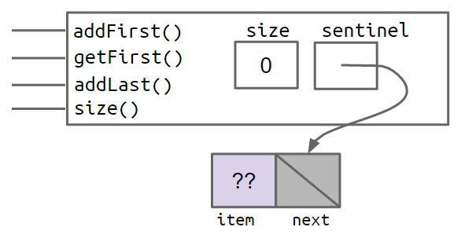

而带有 5、10 和 15 项的 `SLList` 将会是这样的：


---

## DLList

对于上一章里的函数`addLast(int x)`，即在链表结尾加值

它是从头遍历到尾的，非常慢

我们可以添加一个**变量**来加快

~~~java
public class SLList {
    private IntNode sentinel;
    private IntNode last; 
    private int size;    

    public void addLast(int x) {
        last.next = new IntNode(x, null);
        last = last.next;
        size += 1;
    }
    ...
}
~~~

类似于：


那如果我要对倒数第二个`IntNode`进行操作呢？

遍历的话显然不好，再创建一个变量也不是最优解

我们不妨改一下`IntNode`

~~~java
public class IntNode {
    public IntNode prev; /** 加一个前向指针 */
    public int item;
    public IntNode next;
}
~~~

这样就有了一个**双向链表**，即`DLList`

看起来像这样：

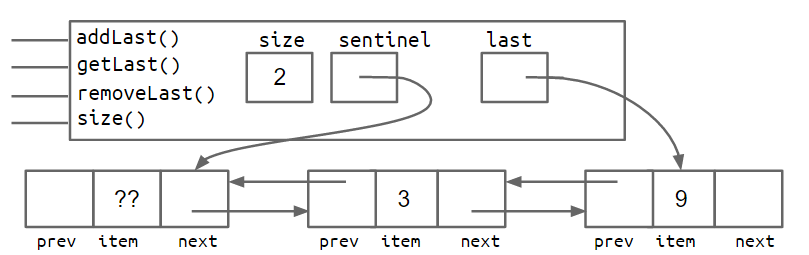

这样还是不好，当列表为**空**时，`last`指向**头哨兵**

如果要`addLast`，那就要先检查是否空列表，如果为空，那就不能`last.next = new IntNode(x, null)`

而是要设置**哨兵**的`next`，然后`last`再重新指向

为了避免反复`if`检查是否空列表，我们在列表**末端**再添加一个**哨兵节点**


另一种实现方式是将列表实现为循环链表，前端指针和后端指针共享同一个哨兵节点。

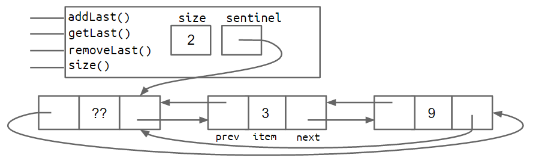

对于更通用的列表，肯定不会只满足于`int`

我们可以使用泛型创建能够保存任意引用类型的数据结构

~~~java
public class DLList<BB> { /** 随便取的一个名 */
    private IntNode sentinel;
    private int size;

    public class IntNode {
        public IntNode prev;
        public BB item;
        public IntNode next;
        ...
    }
    ...
}
~~~

实例化

~~~java
DLList<String> d2 = new DLList<>("hello");
d2.addLast("world");
~~~

---

## 数组

数组的三种创建方式：

- `x = new int[3];`
- `y = new int[]{1, 2, 3, 4, 5};`
- `int[] z = {9, 10, 11, 12, 13};`

代码`System.arraycopy`实现数组的复制，它需要五个参数，分别为：

用作源数组的数组，在源数组中的起点位置，用作目标数组的数组，在目标数组中的起点位置，要复制多少项

---

## AList

对于双链列表`DLList`，如果我们要得到某一项，总是需要从前端或后端遍历列表

这依旧线性，不高效

我们尝试做一个基于数组的链表

对于`addLast`、`getLast`、`get`和`size`，都是比较好解决的

数组的大小是固定的，如果我们要调整数组大小

~~~java
int[] a = new int[size + 1];
System.arraycopy(items, 0, a, 0, size);
a[size] = 11;
items = a;
size = size + 1;
~~~

但是`addLast`的性能相比`SLList`还是非常的差，先看它的代码

~~~java
public void addLast(int x){
    if(size == items.length){
        int[] a = new int[size + 1];
        System.arraycopy(items, 0, a, 0, size);
        items = a;
    }
    items[size] = x;
    size += 1;
}
~~~

每次调用它时我们都要**创建**一个数组并**重新复制**原先数组的内容

即每一次操作都是**线性**的，一共调用`n`次，积分后就是**抛物线**

而在`SLList`里，每一次`addLast`的时间是相同的，都为常数

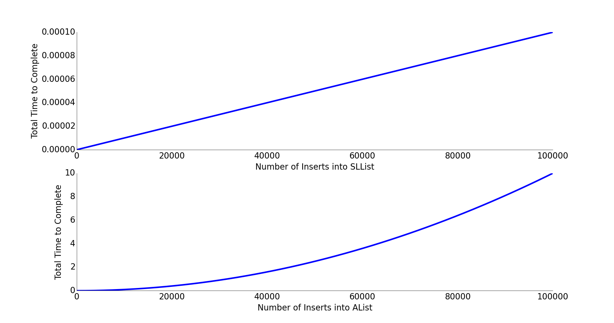

我们可以通过将数组大小按**乘法倍增**的方式来解决性能问题

~~~java
public void insertBack(int x) {
    if (size == items.length) {
           resize(size * RFACTOR);
    }
    items[size] = x;
    size += 1;
}
public void resize(int capacity){
    int[] a = new int[capacity];
    System.arraycopy(items, 0, a, 0, size);
    items = a;
}
~~~

大幅减少了`new`的次数

下面我们来试试任何数据类型，但是Java不允许我们创建泛型对象的数组，类似：

~~~java
Glorp[] items = new Glorp[8];
~~~

我们得用这个：

~~~java
Glorp[] items = (Glorp []) new Object[8];
~~~

还有，我们得将删除后的项设为`null`，提高性能

# 继承与实现

## 引入与接口

上面我们创建的两个列表类：`SLList` 和 `AList`，两者非常相似

假设我们想要编写一个在 `SLList` 中计算最长字符串的方法，如下

~~~java
public static String longest(SLList<String> list) {
    ...
}
~~~

如果我们也可以直接用在`AList`上，把上面的`SLList`换成`AList`即可

即**方法重载**，即同一方法在不同类型上的两种重载，但它有若干缺点

- 它非常重复且丑陋

- 需要维护的代码更多
- 如果我们想要增加更多的列表类型，我们就需要为每个新的列表类复制该方法

接下来我们先说说**接口**


我们定义 **SLList** 和 **AList**是 **List61B** 的**下位词（子类）**

相反就是**上位词（父类）**

**子类**和**父类**之间的关系应当是“is-a”关系

 List61B 就是 Java 所说的**接口**，它本质上是一个合同，规定了一个列表必须能够做什么

要建立关系层次结构，第一步就是创建一个**上位词**

~~~java
public interface List61B<Item> {
    public void addFirst(Item x);
    public void add Last(Item y);
    public Item getFirst();
    public Item getLast();
    public Item removeLast();
    public Item get(int i);
    public void insert(Item x, int position);
    public int size();
}
~~~

第二步就是指定**下位词**，在Java中，我们在类定义中明确这种关系

~~~java
public class AList<Item> {...}
~~~

变成：

~~~java
public class AList<Item> implements List61B<Item>{...}
~~~

这样`AList`就具备`List61B`的属性和行为

在子类中实现所需函数时，将 `@Override` 标签就放在方法签名的最上方是一种好习惯，编译器会在过程中出现错误时告诉你

~~~java
@Override
public void addFirst(Item x) {
    insert(x, 0);
}
~~~

---

## 接口与实现继承

**接口继承**是指子类继承父类所有方法/行为的关系

下面来说说**实现继承**

一般来说，接口中不能实现函数，实现由子类来做

但我们可以通过`default`关键字来实现

~~~java
default public void print() {
    ...
}
~~~

`@Override`这个标签也可以覆盖`default`所实现的方法

那么 Java 如何知道要调用哪一个 print() ？

Java 之所以能够做到这一点，是因为所谓的**动态方法选择**

~~~java
List61B<String> lst = new SLList<String>();
~~~

`lst` 的类型是 `List61B`。这被称为“`静态类型`”

`lst` 指向的对象的类型是 `SLList`，但它也是一个 `List61B`

由于对象本身是使用 `SLList` 构造函数实例化的，我们把它称为它的“`动态类型`”，它会根据它当前所引用对象的类型而改变。

当 Java 运行一个被重写的方法时，它会在它的动态类型中查找合适的方法签名并执行它。

**重要提示：这对于重载的方法不起作用！**

对于重写和重载的区分：

- **重写是“子类改变父类的行为”**

- **重载是“同一个类中提供多个同名但参数不同的工具”**

对于接口继承和实现继承的区分：

- **接口继承（什么）：仅仅告诉子类应该能做什么**

- **实现继承（如何）：告诉子类它们应该如何行为**

---

## 类的层次关系

下面我们来实现**类之间**定义层次关系

```java
public class RotatingSLList<Item> extends SLList<Item>
```

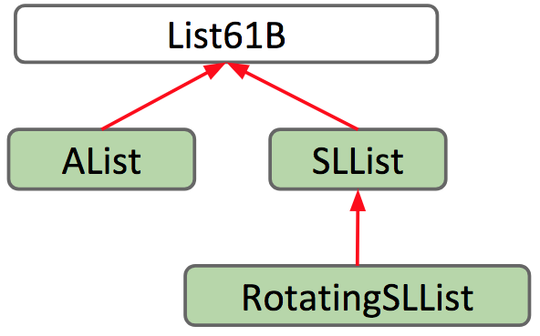

**重载**同样生效

```java
@Override
public Item removeLast() {
    Item x = super.removeLast();
    deletedItems.addLast(x);
    return x;
}
```

还有，子类会继承父类的所有成员，其中包括实例变量和静态变量、方法以及嵌套类，但不包括**构造函数**

我们可以显式地调用父类的构造函数，使用 `super` 关键字：

```java
public VengefulSLList() {
    super();
    deletedItems = new SLList<Item>();
}
```

或者，如果我们不这样做，Java 将会自动为我们调用父类的无参构造函数

关于对象类，Java 中的每个类都是 `Object` 类的后代，即子类

还有封装，详细概念就不讲了，简单来说就是隐藏内部细节，提供接口，提一下就行

---

## 表达式

使用 `new` 关键字的表达式也具有编译时类型，例如：

```java
SLList<Integer> sl = new VengefulSLList<Integer>();
```

编译器会检查 `VengefulSLList` 是否 “is-a” `SLList`

在某些情况中，会出现这样的代码：

~~~java
子类 name = 父类对象；
~~~

这样会报错，但可以解决，用强制转换

~~~java
子类 name = (子类) 父类对象；
~~~

---

## 高阶函数

高阶函数是将**其他函数**作为数据来处理的函数，下面我们来实现用接口来处理

```java
public interface IntUnaryFunction {
    int apply(int x);
}
```

再写个类来实现

```java
public class TenX implements IntUnaryFunction {
    /* Returns ten times the argument. */
    public int apply(int x) {
        return 10 * x;
    }
}
```

```java
public static int do_twice(IntUnaryFunction f, int x) {
    return f.apply(f.apply(x));
}
```

调用就是

```java
System.out.println(do_twice(new TenX(), 2));
```

----

## 子类型多态性

在 Java 中，多态指对象可以具有多种形式或类型

在oop中，多态涉及对象可以被视为其自身类的实例、其父类的实例、其父类的父类的实例等

我们先看一串代码：

```java
public static Object max(Object[] items) {
    int maxDex = 0;
    for (int i = 0; i < items.length; i += 1) {
        if (items[i] > items[maxDex]) {
            maxDex = i;
        }
    }
    return items[maxDex];
}

public static void main(String[] args) {
    Dog[] dogs = {new Dog("Elyse", 3), new Dog("Sture", 9), new Dog("Benjamin", 15)};
    Dog maxDog = (Dog) max(dogs);
    maxDog.bark();
}
```

这会有报错，问题出在

```java
if (items[i] > items[maxDex]) {
```

运算符`>`无法用于Dog类型

如果我们单独定义一个`maxDog`的函数，那在后面其他类中会出现更多的`max`函数，结果有大量的冗余代码

根本问题在于Java里对象不能 `>` 比较，我们可以用接口继承来解决

我们可以创建一个接口，确保任何实现类（例如 Dog）都包含一个比较方法，我们将其命名为 `compareTo` 

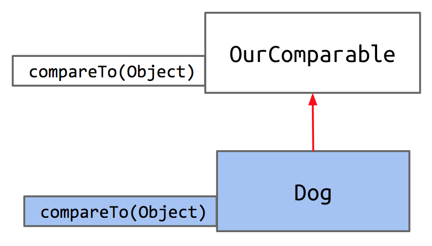

```java
public interface OurComparable {
    public int compareTo(Object o);
}
```

```java
public class Dog implements OurComparable {
...
	public int compareTo(Object o) {
    	Dog uddaDog = (Dog) o; 
    	if (this.size < uddaDog.size) {
        	return -1;
    	} else if (this.size == uddaDog.size) {
        	return 0;
    	}
    	return 1;
	}
}
```

由于 `compareTo` 接受任意对象 Object o，我们必须将输入强制转换为 Dog

这样我们来对`max`进行泛化

```java
public static OurComparable max(OurComparable[] items) {
    int maxDex = 0;
    for (int i = 0; i < items.length; i += 1) {
        int cmp = items[i].compareTo(items[maxDex]);
        if (cmp > 0) {
            maxDex = i;
        }
    }
    return items[maxDex];
}
```

`compareTo`还可以进行优化

```java
public int compareTo(Object o) {
    Dog uddaDog = (Dog) o;
    return this.size - uddaDog.size;
}
```

我们刚才构建的 `OurComparable` 接口可以工作，但并不完美

- 尴尬的`Objects`强制转换
- 没有现有的类实现或使用 `OurComparable`

我们可以利用一个已存在的接口，名为 `Comparable` 


`Comparable`采用的是通用类型，避免了强制转换

现在让我们重写`Dog`的代码

```java
public class Dog implements Comparable<Dog> {
    ...
    public int compareTo(Dog uddaDog) {
        return this.size - uddaDog.size;
    }
}
```


还有一个非常相似的接口，称为 `Comparator` 

让我们先定义一些术语

- 自然顺序 - 用来指涉在某个特定类的 `compareTo` 方法中隐含的排序。

假如我们想以与其自然排序不同的方式对狗进行排序，例如按名字的字母顺序排序，怎么做？

首先，我们要知道这个接口包含什么

```java
public interface Comparator<T> {
    int compare(T o1, T o2);
}
```

这表明 `Comparator` 接口要求任何实现类都实现 `compare` 方法

```java
private static class NameComparator implements Comparator<Dog> {
    public int compare(Dog a, Dog b) {
        return a.name.compareTo(b.name);
    }
}

public static Comparator<Dog> getNameComparator() {
    return new NameComparator();
 }
```

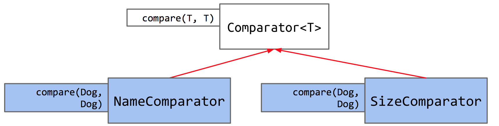

`Comparable`是对象本身与另一个对象进行比较”，它被嵌入在对象本身中，并且它定义了一个类型的自然排序。另一方面，`Comparator` 更像是一个第三方机器，用来将两个对象互相比较。由于只有一个 `compareTo` 方法的空间，如果我们想要多种比较方式，必须转向 `Comparator`

# 异常，迭代器，可迭代对象...

## Lists,Sets,ArraySet

在上面，我们已经构建了`AList`和`SLList`，以及接口`List61B`来强制实现特定的列表方法 ，下面是代码链接

- [List61B](https://github.com/Berkeley-CS61B/lectureCode-sp19/blob/master/inheritance2/List61B.java)
- [AList](https://github.com/Berkeley-CS61B/lectureCode-sp19/blob/master/inheritance1/AList.java)
- [SLList](https://github.com/Berkeley-CS61B/lectureCode-sp19/blob/master/inheritance2/SLList.java)

还有`List61B`类型的使用

```java
List61B<Integer> L = new AList<>();
L.addLast(5);
L.addLast(10);
L.addLast(15);
L.print();
```

Java提供了内置的`List`接口，例如`ArrayList`

由于 `List` 是一个接口，我们不能对它进行实例化！我们必须对它的某个实现进行实例化

我们可以使用类、接口的全名(规范名)来实现

```java
java.util.List<Integer> L = new java.util.ArrayList<>();
```

这有点冗长，我们可以导入Java库，例如:

```java
import java.util.List;
import java.util.ArrayList;

public class Example {
    public static void main(String[] args) {
        List<Integer> L = new ArrayList<>();
        L.add(5);
        L.add(10);
        System.out.println(L);
    }
}
```

集合`Set`也一样

```java
import java.util.Set;
import java.util.HashSet;
Set<String> s = new HashSet<>();
s.add("Tokyo");
s.add("Lagos");
System.out.println(s.contains("Tokyo")); // true
```

还有我们自己的集合`ArraySet`，具备：

- `add(value)` ：如果尚未存在则将该值添加到集合中

- `contains(value)` : 检查 ArraySet 是否包含该键

- `size()` : 返回值的数量

都挺简单的，详细代码就不放出来了

---

## 抛出异常

在上面`ArraySet`的`contains(value)`里，我们会用到`items[i].equals(x)`，当`items[i]` 处的值为 null，就会有**NullPointerException**，出现异常

在 Java 中，异常是对象，我们使用以下格式抛出异常：

`throw new ExceptionObject(parameter1, ...)`

 我们来更新`add`方法：

```java
/* Associates the specified value with the specified key in this map.
   Throws an IllegalArgumentException if the key is null. */
public void add(T x) {
    if (x == null) {
        throw new IllegalArgumentException("can't add null");
    }
    if (contains(x)) {
        return;
    }
    items[size] = x;
    size += 1;
}
```

---

## 迭代

我们有一个干净的增强型 for 循环，例如：

```java
Set<String> s = new HashSet<>();
s.add("Tokyo");
s.add("Lagos");
for (String city : s) {
    System.out.println(city);
}
```

这可以翻译为：

```java
Set<String> s = new HashSet<>();
...
Iterator<String> seer = s.iterator();
while (seer.hasNext()) {
    String city = seer.next();
    ...
}
```

我们可以构建自己的类来实现，关键在于一个名为迭代器的对象

首先，我们使用`Iterator<Integer> seer = friends.iterator();`获取一个新的迭代器对象

接下来，我们用`while`遍历。我们用seer.hasNext()`来检查是否仍然有未处理的项

最后，`seer.next()` 同时做两件事。它返回列表的下一个元素，它也把迭代器前进一个项目

---

## 对象方法

所有类都继承自总体的`Object`类，继承的方法如下：

- `String toString()`
- `boolean equals(Object obj)`
- `Class <?> getClass()`

- ......

我们重点讨论前两个

### toString()

`toString()` 方法提供对象的**字符串**表示。 `System.out.println()` 函数会隐式地对传递给它的任意对象调用此方法并打印返回的字符串

当你运行 `System.out.println(dog)` 时，实际上就是在执行这个：

```java
String s = dog.toString()
System.out.println(s)
```

### equals()

`equals()` 和 `==` 在 Java 中的行为不同。`==`：对于原始类型，意味着检查值是否相等，对于对象，意味着检查地址/指针是否相等

`equals(Object o)`默认行为类似于 ==，即检查 this 的内存地址是否与 o 相同，当然，我们可以进行覆写，此处不展开

# 高效编程

效率有两种形式：一个编程成本，一个执行成本(时间和空间复杂度)

我们先来看看时间复杂度

我们用**操作数**来预测每一个的**大致量级**

for循环多是N的次幂，递归多是n的N次方

二分法Θ(logN)，归并Θ(NlogN)

下面是一些解释

|                   | Informal Meaning                                 | Example Family |
| :---------------- | :----------------------------------------------- | :------------- |
| Big Theta Θ(f(N)) | Order of growth is f(N)                          | Θ($N^2$)       |
| Big O O(f(N))     | Order of growth is less than or equal to f(N)    | O($N^2$)       |
| Big Omega Ω(f(N)) | Order of growth is greater than or equal to f(N) | Ω($N^2$)       |

# 不相交集合

没有相同元素的集合，就称为不相交集合DisjointSets，或并查集，它一般有两种操作：

1. `connect(x, y)`：将x与y连接起来，亦称为union
2. `isConnected(x, y)`：若x与y已连接（即属于同一集合），则返回true

图示的话


直觉上，我们也许会先考虑将不相交集合表示为一组集合的列表，例如 `List<Set<Integer>>`

但查找起来很不方便

让我们考虑另一种方法，使用一个整数数组

**索引**代表我们集合中的**元素**，**索引处的值**是它所属的**集合编号**

例如，我们将 `{0, 1, 2, 4}, {3, 5}, {6}` 表示为：


我们要使`connect`变得快速，可以给每个项分配其父项的索引，没有父项就是一个“根”，值为负

例如：

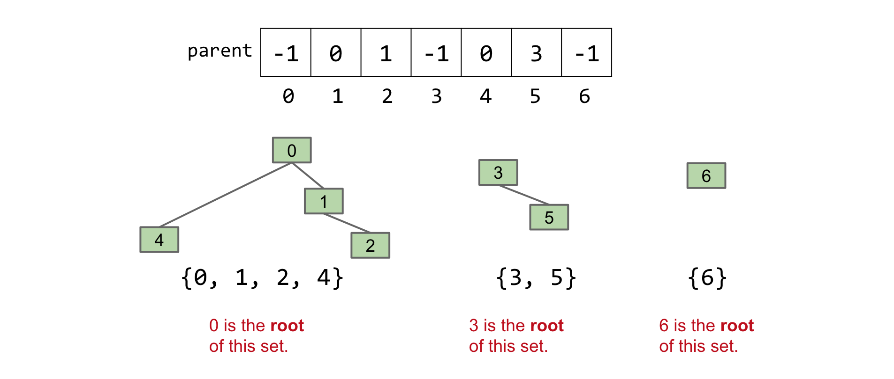

我们定义`find(int item)`，它返回树`item` 所在的根

现在`connect`两项，就是找两者的根节点，然后使一个变为子项；`isConnected(x, y)`就是判断根的异同

```java
public class QuickUnionDS implements DisjointSets {
    private int[] parent;

    public QuickUnionDS(int num) {
        parent = new int[num];
        for (int i = 0; i < num; i++) {
            parent[i] = i;
        }
    }

    private int find(int p) {
        while (parent[p] >= 0) {
            p = parent[p];
        }
        return p;
    }

    @Override
    public void connect(int p, int q) {
        int i = find(p);
        int j = find(q);
        parent[i] = j;
    }

    @Override
    public boolean isConnected(int p, int q) {
        return find(p) == find(q);
    }
}
```

我们继续改进，调用`find`时，必须爬到树的根节点，时间与树的长度有关

如果我们每次`connect`时，将较**小**树连接到较**大**树，那长度相较于大连小会更短！


任意树的最大高度为Θ(log N)，`connect` 和 `isConnected` 的运行时间就小于O(log N)

还可以改进，调用`find`时，我们把该点到根的所有项连接到根上

在调用无数多次后，基本上所有元素就直接指向它们的根

| Implementation             | `isConnected` | `connect` |
| -------------------------- | ------------- | --------- |
| Quick Find                 | Θ(N)          | Θ(1)      |
| Quick Union                | O(N)          | O(N)      |
| Weighted Quick Union (WQU) | O(log N)      | O(log N)  |
| WQU with Path Compression  | O(α(N))*      | O(α(N))*  |

# ADTs 和 树

## ADT

抽象数据类型（ADT）仅由其**操作定义**，而非实现方式

例如在 proj1a 中，ArrayDeque 和 LinkedListDeque 具有相同的方法，但实现方式却有很大不同

我们说 ArrayDeque 和 LinkedListDeque 是 Deque ADT 的实现

一些常用的ADT包括：栈，列表，集合，映射

---

## 二叉搜索树

我们在链表中查找一个项需要很长时间，即便链表排序，也可能线性时间

对于数组而言，可以用二分查找，那链表呢？

我们可以获得中间节点的应用，然后遍历左右，过程中再添加指向中间节点的指针，来进一步优化

如果你从垂直的方向来看这个的话，就会看到一棵树！

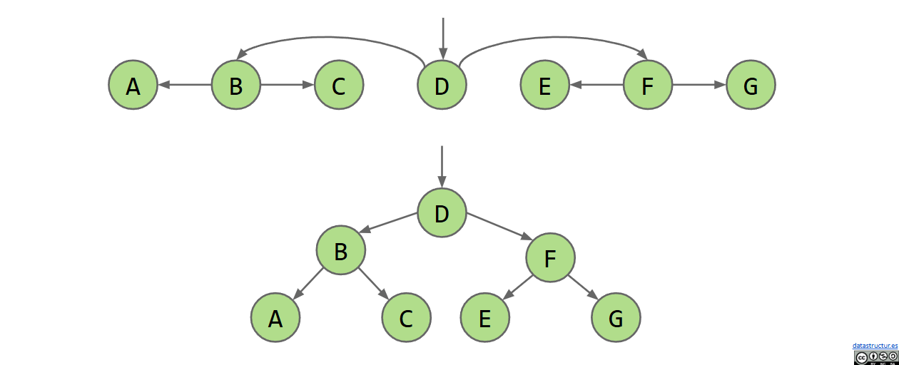

因为每个交汇点都分成两个分支，这样特定的树就被称为**二叉树**(BT)

树由节点和边组成，二叉树的每个节点只有 0、1 或 2 个子节点

而对于**二叉搜索树**(BST)，除了满足二叉树，还要满足对于任意节点 **X**

- 左子树中的每个键都小于 **X** 的键

- 右子树中的每个键都大于 **X** 的键

**查找**：在BST中，因为上面的性质，二分搜索变得非常轻松，且时间上限为 log(n)

```java
static BST find(BST T, Key sk) {
   if (T == null)
      return null;
   if (sk.equals(T.key))
      return T;
   else if (sk ≺ T.key)
      return find(T.left, sk);
   else
      return find(T.right, sk);
}
```

**插入**：首先我们先查找该节点，没有的话就将其添加在所在叶节点的左或右

```java
static BST insert(BST T, Key ik) {
  if (T == null)
    return new BST(ik);
  if (ik ≺ T.key)
    T.left = insert(T.left, ik);
  else if (ik ≻ T.key)
    T.right = insert(T.right, ik);
  return T;
}
```

**删除**：我们要保证BST的性质，不妨将要删的节点分为三类：有 0，1 和 2 个子节点

- 0个子节点

那它就是一个叶子节点，删除父指针即可(把父节点指向它的指针设为 `null`)

- 1个子节点

它和它的所有子节点都小于或大于其父节点，那就让父节点重新指向子节点即可

- 2个子节点

我们选择一个新节点来替换被删除的节点，该节点要**大于**左子树的所有节点，**小于**右子树的所有节点

而**左子树**的**最大**节点就是**最右边**的节点，**右子树**的**最小**节点就是**最左边**的节点，这两个节点都满足上面两个条件

然后我们两者择其一覆盖要删除的节点，最后删除原本的它即可

# 平衡树

先来说明一些相关术语：

**深度**：点到根节点之间的连接数量

**高度**：树的最低深度

树的最大高度决定了最坏情况的运行时间

而你将节点插入到二叉搜索树中的顺序决定了其高度

显然很多情况下，我们无法决定数据的顺序

平衡树可以很好地解决相关问题

---

我们知道 BST 的问题在于我们总是往叶节点插入

我们试试一个节点内容纳多个元素，而太多的元素会导致N的运行时间，所以我们还要限制单个节点中元素的数量

例如：我们限制数量为3，当超过这个数量时，就分裂

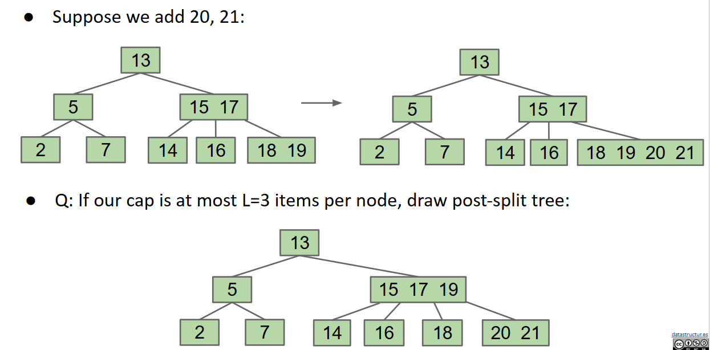

**15 17**节点的每个子节点要么小于、介于或大于 15 和 17

这样保持了有序，以便二分的进行

这些树被称为 **B 树** 或 **2-3-4/2-3 树**

2-3-4 和 2-3 指的是每个节点可以拥有的子节点数量

**插入**过程就是：先沿着树向下遍历，不断比较，到达叶节点，如果已满，就将中间节点（key）向上“分裂”到父节点。如果父节点也满，就重复该过程

---

我们在上面提到，在BST中插入时，顺序很重要

这同样对B树成立，B树的高度可能会变化，但它总会保持“茂盛”

B 树具有以下有用的不变量：

- 所有叶子距离源头的距离相同

- 一个非叶子节点包含 k 个元素时，恰好有 k+1 个子节点

同时，这些不变量使得树始终是“茂盛”

---

平衡树的实现是相当困难的，这里我们引入旋转的概念，其定义是：

**rotateLeft(G): Let x be the right child of G. Make G the new left child of x.**

**rotateRight(G): Let x be the left child of G. Make G the new right child of x.**

举个例子：

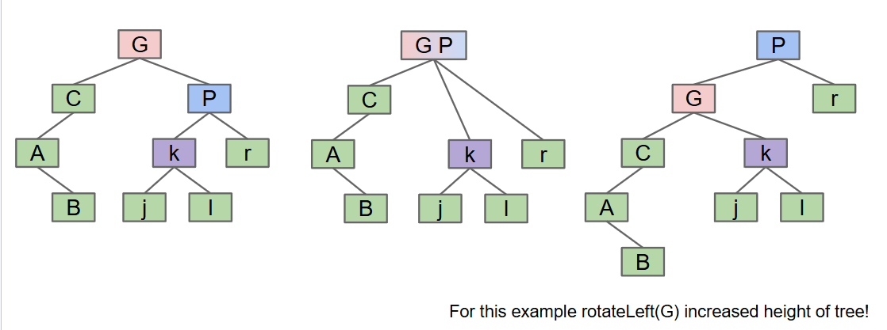

G 的右子节点 P 与 G 合并，连带它的子树一起。随后 P 将其左子节点传给 G，G 向左下方移动成为 P 的左子节点

下面是实现

```java
private Node rotateRight(Node h) {
    // assert (h != null) && isRed(h.left);
    Node x = h.left;
    h.left = x.right;
    x.right = h;
    return x;
}

// make a right-leaning link lean to the left
private Node rotateLeft(Node h) {
    // assert (h != null) && isRed(h.right);
    Node x = h.right;
    h.right = x.left;
    x.left = h;
    return x;
}
```

---

我们发现，**2-3树**平衡，但实现困难，**BST**相反，两者若能兼得，那就very good了

对于2节点，我们不用做处理；对于3节点，有两个键，我们把左边的键，即较小的那个键取出来，用**红色**链接来连接两者，其余用**黑色**连接，这样就形成了**左倾红黑树（LLRB）**

它有一些性质：

- 没有节点同时拥有两个红色链接

- 没有红色的右链接

- 每一条从根到叶的路径都具有相同数量的黑色链接

- 高度不大于相应的 2-3 树的两倍高度

对于**插入**，我们更希望像BST一样插入，但普通的插入会破坏LLRB的规则，下面来给出一些规范：

1. 插入颜色永远是**红色**

因为在 2-3 树里，插入就是往叶子节点里塞一个键，是**融合**关系，是同一层，得用红链接

2. 右边出现了红链接

执行左旋转，把父节点拉下来，把右孩子提上去

3. 左边出现了连续两条红链接

此时出现 4- 节点，得改，我们先右旋转，把中间的红节点转上去，然后把其左右节点都变黑，自身与父节点融合，变红

当我们插入完后违反了这些规范，就执行操作，下面是插入的抽象代码

```java
private Node put(Node h, Key key, Value val) {
    if (h == null) { return new Node(key, val, RED); }

    int cmp = key.compareTo(h.key);
    if (cmp < 0)      { h.left  = put(h.left,  key, val); }
    else if (cmp > 0) { h.right = put(h.right, key, val); }
    else              { h.val   = val;                    }

    if (isRed(h.right) && !isRed(h.left))      { h = rotateLeft(h);  }
    if (isRed(h.left)  &&  isRed(h.left.left)) { h = rotateRight(h); }
    if (isRed(h.left)  &&  isRed(h.right))     { flipColors(h);      } 

    return h;
}
```

# 哈希

目前为止，我们学习了很多搜索项是否存在，但有一些局限性，例如在树里，要求项目可比较，复杂度是Θ(logN)，我们可以试试更好的方法

**哈希**的基础思想是用空间换时间，new一个数组，将项作为下标，对应的值为 **true** or **false **来表示存在与否

将一个对象转换为某个整数的过程被称为“计算对象的哈希码”，每个 Java 对象都有一个默认的 `.hashcode()` 方法，Java 通过找出 `Object` 在内存中的位置来计算，进而提供一个唯一的哈希码

我们创建哈希表要解决三个问题：**空间**，**时间**和**冲突**(同一哈希值)

我们有一个方案：

对于空间，我们选择一个模，设为数组大小，将哈希值通过模运算来加入数组，这样每个都会覆盖到

对于冲突，将数组里的项改为**list**，同一哈希值就都接入这个**list**中

对于时间，我们试试动态扩展哈希表，更改模数，再重新加入到新的表中

# 优先队列接口

优先队列是一种用于优化处理最小元素或最大元素的抽象数据类型，空间占用较小

我们之前看到，对于插入，删除，查看等PQ操作，运行时间较好的是**BST**，即**二叉搜索树**，我们可以修改一下，进一步提高效率

我们将把**二元最小堆**定义为完全且遵守**最小堆**性质：

- 最小堆：每个节点都小于或等于其两个子节点

- 完全：只有在最底层可能缺少节点，所有节点尽可能向左对齐

类似图中绿色的堆：

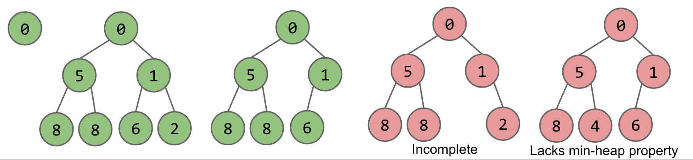

我们关心的 PriorityQueue ADT 的三种方法是 `add` 、 `getSmallest` 和 `removeSmallest`

- `add` ：临时添加到堆的末尾。向上在层级中游动到合适的位置。
	- 游动涉及在子节点小于父节点时进行节点交换

- `getSmallest` : 返回堆的根节点（根据我们的最小堆性质，这保证它是最小值）

- `removeSmallest` ：将堆中的最后一个项交换到根节点。向下调整直至合适的位置。
	- 沉涉及在父节点大于子节点时交换节点。与最小子节点交换以保持最小堆性质。

现在我们来考虑一下树的表示

由于树是完全的，确保了数组中无空缺，那就有下图所示：

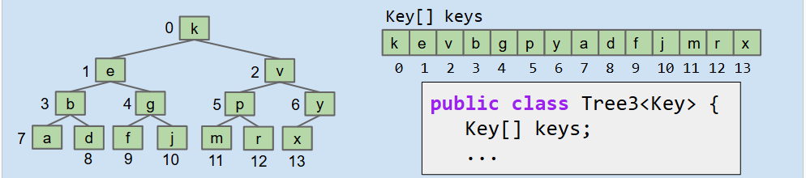

父节点与子节点之间的有数字关系，就可以直接：

~~~java
public int parent(int k){
	return (k - 1) / 2;
}
~~~

`leftChild(k)`，`rightChild(k)`，`parent(k)`都可以直接得出了

妙哉啊！

| 方法             | 有序数组 | 二叉搜索树 | 哈希表 | 堆      |
| ---------------- | -------- | ---------- | ------ | ------- |
| `add`            | Θ(N)     | Θ(logN)    | Θ(1)   | Θ(logN) |
| `getSmallest`    | Θ(1)     | Θ(logN)    | Θ(N)   | Θ(1)    |
| `removeSmallest` | Θ(N)     | Θ(logN)    | Θ(N)   | Θ(logN) |

# 树遍历与图论

## 树遍历

树的概念方面就不赘述了，我们直接来看看树的遍历

树的遍历方式不止一种：

- **层序遍历**
- **深度优先遍历**——其中有三种：**前序遍历**、**中序遍历**和**后序遍历**

**层序遍历**，顾名思义，就是按层次从左到右进行遍历

**前序遍历**，就是先操作，再遍历左树，然后是右树

```java
preOrder(BSTNode x) {
    if (x == null) return;
    print(x.key)
    preOrder(x.left)
    preOrder(x.right)
}
```

**中序遍历**，略有不同，它是先遍历左树，再操作，最后右树

**后序遍历**，同理，先左树，再右树，最后操作

---

## 图论

树很棒，但是存在比如两节点直接只能有一条边的限制，图不一样

图由以下部分组成：

- 一组节点（或顶点）

- 至多包含若干条边的集合，每条边连接两个节点

其余概念就不说明了 ）

图有很多问题可以提出：

- s-t 路径：顶点 s 和 t 之间是否存在一条路径？
- 连通性：图是否连通，即是否存在从所有顶点到达的路径？
- 循环检测：图中是否包含任何循环？
- ......

我们先来解决一道简单一点的问题：s-t 路径

换句话说，编写一个函数 `connected(s, t)` ，它接受两个顶点并返回两者之间是否存在路径

```java
if (s == t):
    return true;

for child in neighbors(s):
    if connected(child, t):
        return true;

return false;
```

这样不行，会产生无限循环，相邻两点间会反复循环

这时候我们不妨添加一个mark标记，来记录我们去过的地方

直观地说，我们是在深入探索，后面我们会学习更加复杂的图遍历 ）

# 图遍历与表示

在上面，我们开发了**DFS**（**深度优先搜索**）遍历

在 **DFS** 中，我们在开始查看第二个子节点之前，先访问第一个子节点的整条子树——我们字面意义上是先深度搜索

在这里，我们将讨论 **BFS**（**广度优先搜索**）（也称为**层次遍历**）

在 **BFS** 中，我们在继续访问任何孙节点之前，先访问所有直接子节点。换句话说，我们访问源节点距离为 1 的所有节点。然后，访问距离为 2 的所有节点，依此类推

部分代码如下：

```java
Queue<Integer> fringe = new LinkedList<>();
// 1. 初始化：标记起点，加入队列，距离设为 0
marked[s] = true;
distTo[s] = 0;
fringe.add(s);

 // 2. 循环直到队列为空
while (!fringe.isEmpty()) {
	// 3. 从队列中取出一个顶点 v
	int v = fringe.poll();
	// 4. 遍历 v 的所有邻居
	for (int w : G.adj(v)) {
		// 5. 如果邻居 w 还未被访问过
		if (!marked[w]) {
        	// 标记 w
			marked[w] = true;
			// 记录路径：从 v 到 w
			edgeTo[w] = v;
			// 记录距离：起点到 w 的距离 = 起点到 v 的距离 + 1
			distTo[w] = distTo[v] + 1;
			// 将 w 加入队列（稍后探索）
			fringe.add(w);
		}
	}
}
```

`edgeTo[w]` 存储的是“通往顶点 `w` 的上一跳顶点 `v`”

`distTo[w]` 存储的是“从起点 `s` 到顶点 `w` 的最短路径长度（经过的边数）”

# 最短路

最短路问题，我们可以用上面的BFS和DFS来解决，两者各有优劣

- DFS 在细长的图上表现更差，空间复杂度更高

- BFS 在“树状”图上表现更差，因为我们的队列会被大量使用

而 Dijkstra 算法可以更好的解决这类问题

请注意，最短路径（对于边有权重的图）可以包含很多条边。我们关心要最小化的是所选路径上边的权重之和

其次，注意从源点 s 出发的**最短路径树**可以通过以下方式创建：

- 对于图中**每个顶点** v （不是 s ），从 s 找到到 v 的**最短路径**

- 把你上面找到的所有边“**合并/并集**”起来，就完成了

Dijkstra 算法接收一个输入顶点 s ，并输出从 s 出发的最短路径树，下面是工作原理

1. 创建一个优先队列

2. 将 s 以优先级 0 加入到优先队列中，将所有其他顶点以优先级 ∞ 加入到优先队列中

3. 当优先队列非空时：从优先队列中弹出一个顶点，并对该顶点出发的所有边进行松弛

> **“松弛”是什么意思？**

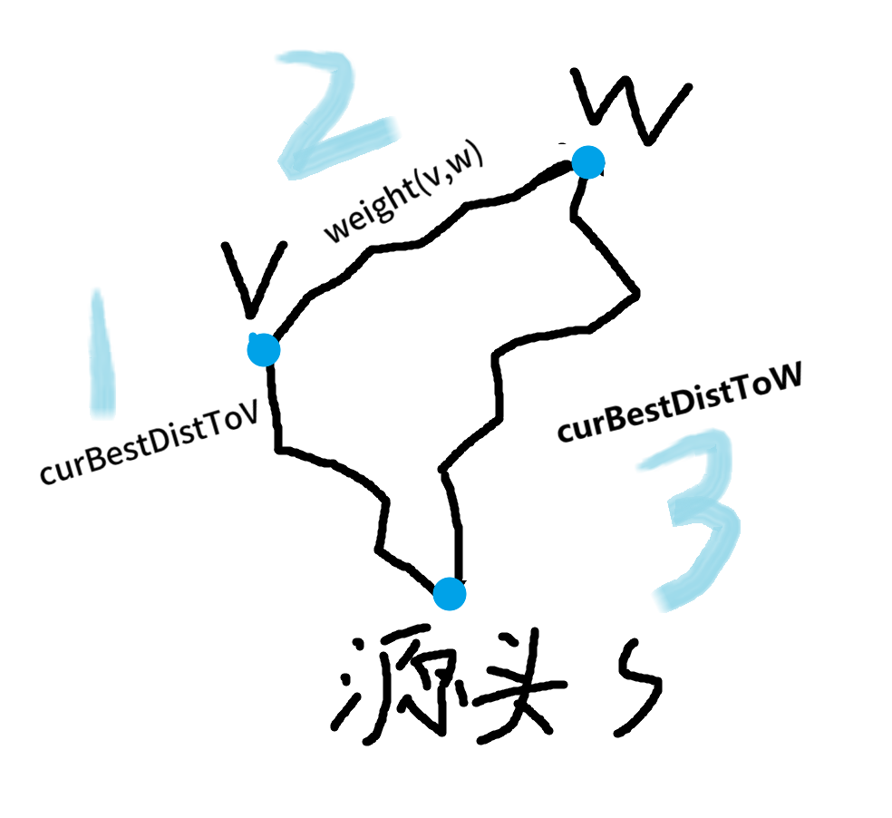

假设我们刚从优先队列中弹出的顶点是 **v** 。我们将查看 **v** 的所有边。假设我们正在查看边 **(v,w)**（从 v 到 w 的边）我们将尝试对这条边进行**松弛**

当我们发现**路径1** + **路径2**更好，即小于**路径3**时，就设置**路径3**等于**路径1**加**路径2**，并将 **edgeTo[w]** 更新为 **v**，上面过程被称为放松

下面是伪代码：

```py
def dijkstras(source):
    PQ.add(source, 0)
    For all other vertices, v, PQ.add(v, infinity)
    while PQ is not empty:
        p = PQ.removeSmallest()
        relax(all edges from p)
        
def relax(edge p,q):
   if q is visited (i.e., q is not in PQ):
       return

   if distTo[p] + weight(edge) < distTo[q]:
       distTo[q] = distTo[p] + w
       edgeTo[q] = p
       PQ.changePriority(q, distTo[q])
```

只要所有边的权值都为非负，Dijkstra 的算法就能保证是最优的

Dijkstra 实际在做的是，先访问所有距离为 1 的节点，然后是距离为 2 的节点，依此类推。呈同心圆分布

下面我们来看看**A*算法**，我们在D算法中得到的都是真实距离，可如果我们想要的是从某个节点到目标节点的一个粗略估计呢？

那么，让我们对我们的D算法做一个小改动，我们将使用 bestKnownDistToV+estimateFromVToGoal 作为我们的优先级

这里是一个 A*算法演示： [demo](https://docs.google.com/presentation/d/177bRUTdCa60fjExdr9eO04NHm0MRfPtCzvEup1iMccM/edit#slide=id.g771336078_0_180)

还有关于估计的要求：

- 可接受性：heuristic(v, target) ≤ trueDistance(v, target)。

- 一致性：对于每一个邻居节点v，有：heuristic(v, target) ≤ dist(v, w) + heuristic(w, target)，其中dist(v, w)是从节点v到节点w的边的权重。

# 最小生成树

**最小生成树（MST）**是在图中可能的连接所有顶点的边集合中权重和最小的那一组

因为它是一棵树，所以必须是**连通且无环**，且因为包含所有顶点，所以被称为“生成”树

在我们开始之前，让我们先介绍**切割**性质（Cut Property），它是一个对于寻找 MST 非常有用的工具

我们可以将**切割**定义为把每个节点分配到两个非空集合中的任意一个

将跨边定义为连接来自一个集合的节点与来自另一个集合的节点的边

有了这两个定义，我们就可以理解**切割**属性；给定任何切割，最小权重的横跨边在最小生成树中

## Prim 算法

这是从图中找到最小生成树的一种算法。其过程如下：

1. 从某个任意的起始节点开始
2. 不断添加那些属于正在构建的 MST 中的最短边
3. 重复这个过程，直到总共有V-1条边为止

直白一点就是**从一个点开始，每次都选择离当前已经建好的这块区域最近的那个点，拉进队伍里，直到把所有点都拉进来。**

类似 Dijkstra 算法，只是将到源顶点的距离换成到当前树的距离

## Kruskal 算法

同样用于MST

1. 将所有边按照从最轻到最重的顺序进行排序
2. 每次取出一个边（顺序遵循排序结果），如果将其加入正在构建的MST中不会导致出现循环，则继续将边加入其中
3. 重复上述步骤，直到共有 V-1 条边被处理完毕

# 字典树

**字典树**（**Tries**）是一种非常有用的数据结构，适用于键可以被分解为“字符”，并且与其他键**共享前缀**的情况（例如字符串）

就像这样：

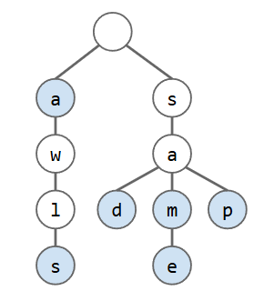

检查字典树是否包含一个键，需要从根节点沿着正确的节点向下遍历整棵树

由于我们将共享节点，我们必须想出一种方法来表示哪些字符串属于集合，哪些不属于集合。我们将通过将**每个字符串**的**最后一个字符**的颜色标记为**蓝色**来解决这个问题

有两种情况我们无法找到一个字符串；要么最终节点是白色（非终结节点），要么找不到那个点

让我们实际尝试构建一个 Trie

```java
public class DataIndexedCharMap<V> {
    private V[] items;
    public DataIndexedCharMap(int R) {
        items = (V[]) new Object[R];
    }
    public void put(char c, V val) {
        items[c] = val;
    }
    public V get(char c) {
        return items[c];
    }
}
```

在这里我们创建了一个以字符作为键的映射实现。值 R 表示可能的字符数量（例如 ASCII 为 128）

```java
public class TrieSet {
   private static final int R = 128; // ASCII
   private Node root;    // root of trie

   private static class Node {
      private char ch;  // 可去除，节点内部不用储存自身字符，在查找时只看next
      private boolean isKey;   
      private DataIndexedCharMap next;

      private Node(char c, boolean blue, int R) {
         ch = c; // 可去除
         isKey = blue;
         next = new DataIndexedCharMap<Node>(R);
      }
   }
}
```

我们发现`next`总是包含128个链接，这难免会造成大量空间上的浪费，我们还可以选其他结构

- BST
	- 空间：每个节点 C 条链，C 是子节点数量
	- 运行时： O(logR) ，其中 R 是字母表的大小

- 哈希表
	- 空间：每个节点 C 条链，C 是子节点数量
	- 运行时： O(R) ，其中 R 是字母表的大小

# 拓扑排序

拓扑排序：对一个有向无环图（DAG）的顶点进行排序，使得对于每条有向边**u→v**，在排序中 u 早于 v

类似这样： 

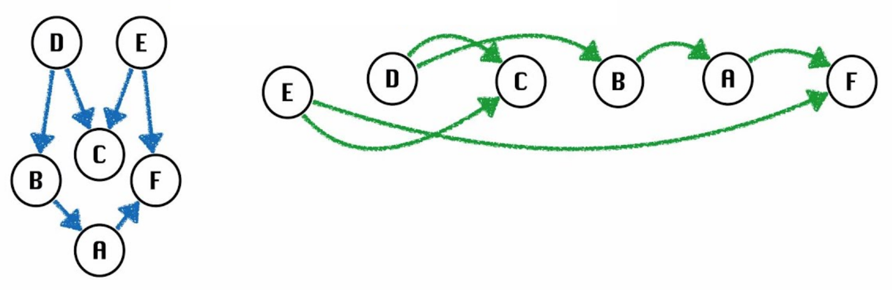

## 实现

若要实现这个算法，可以用DFS或BFS

DFS：**深度优先遍历完所有节点，记下离开(回退)每个节点的顺序(即逆序)，然后把顺序倒过来**

BFS：**选择任意一个入度为 0 的顶点 v，将 v 加入我们的拓扑排序列表，删除顶点 v 及其所有出边，将顶点 v 的所有邻接点的入度减 1，重复直到移除所有点**

## 最短路

用D算法处理存在负边的情况可能会失败，但在DAG里有更好的算法：

**先给图排好序（拓扑排序），然后按这个顺序依次处理每个点，每处理一个点，就更新它所有邻居的距离(即松弛)**

由于我们按拓扑顺序访问顶点，因此只有在考虑完该顶点的所有可能信息后才会访问它。这意味着如果到达 v 的路径中存在负边权，那么在我们到达 v 时，这些信息已经被考虑在内了

## 最长路

一般情况下，可能出现绕圈等情况，但在DAG下，没有循环，可以这样考虑：

1. 建立图 G' 的一个新副本，对所有边的权重取相反数（符号取反）
2. 对 G' 运行 DAG 最短路径，得到结果 X
3. 将 X.distTo 中所有值的符号取反。X.edgeTo 不变

## 约简

由于 DAG-SPT 可以用于解决 DAG-LPT，即最短路可以用来解决最长路，我们可以说DAG-LPT 问题可以被约简为 DAG-SPT 问题

形式上，如果任务 Q 的任何子程序可用于解决 P，则我们说 P 可以化简为 Q

人们可以争辩，在整门课程中我们一直在做约简

然而并不完全是

也许一个更恰当的术语来描述我们在课程早期所完成的工作，是分解

把一个复杂任务分解为更小的部分

使用抽象来使问题解决更容易，这就是计算机科学的核心

> *完结啦*  o(￣▽￣)ブ

> 对于**proj2**的附录：
>
> 我完成到remote的前部分就结束了，真的感觉有点牢（
>
> 对于这个proj，详细的我就不展开了，说说我认为重要的两个部分：弄清**要求**和**结构**
>
> 对于某个命令，你看课程网站上的**要求**可能不清楚是什么意思，翻译后也许更晕了
>
> 这边推荐直接问AI，先问这个命令在Git上是什么功能，有什么限定条件
>
> 再问在Gitlet中是怎样的，这样思路可能会比较清晰一点
>
> (现在还记得**merge**命令里的一堆特判，没弄懂就开始敲，最后依托)
>
> **结构**就是你的代码结构和文件结构
>
> 代码尽量简洁，写写辅助函数，格式取名，加点批注，保持一个好的结构
>
> 可以的话，问问AI，还有什么可以改进的地方
>
> 文件结构，就是你要处理好每一个新增文件的功能和位置
>
> 这样也能提高后续敲代码的效率
>
> OK，就这么多，加油吧！(੭*ˊᵕˋ)੭ଘ
